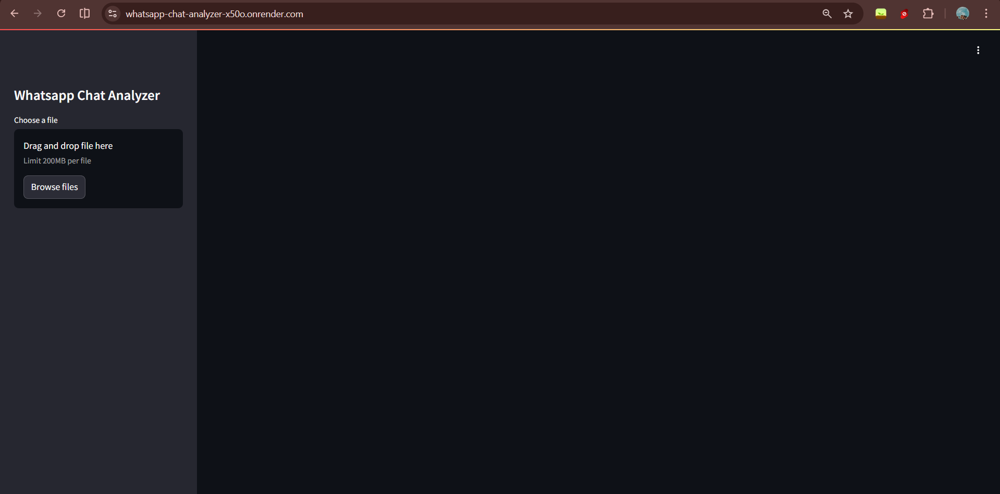
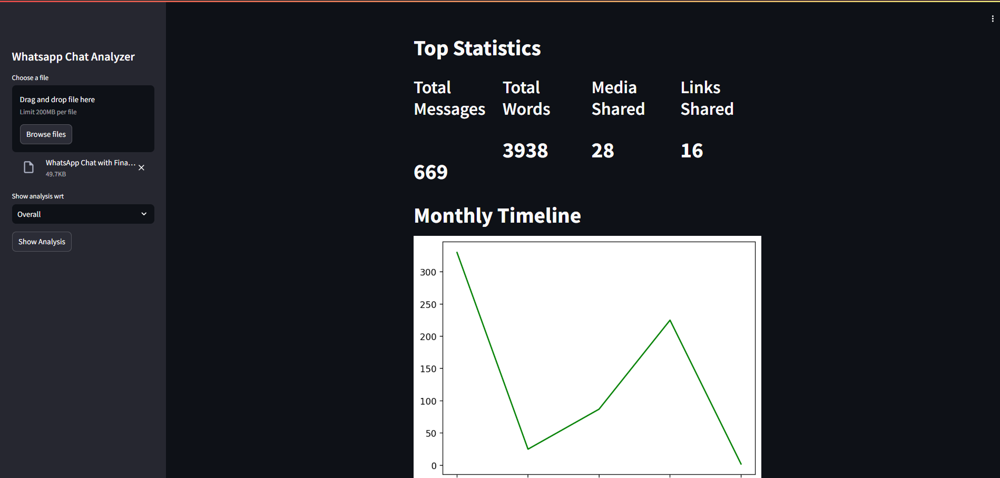
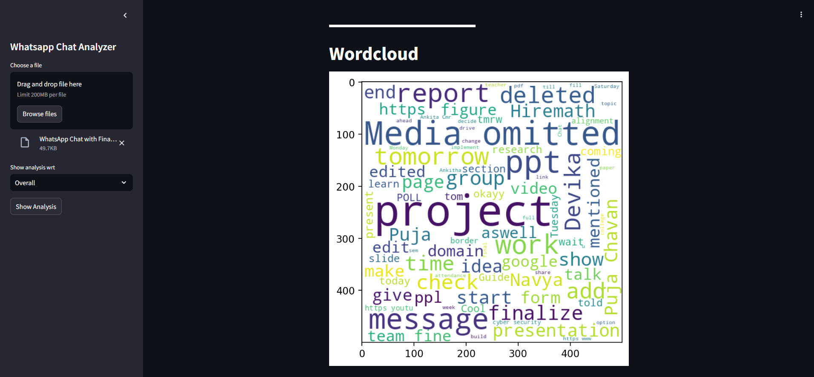
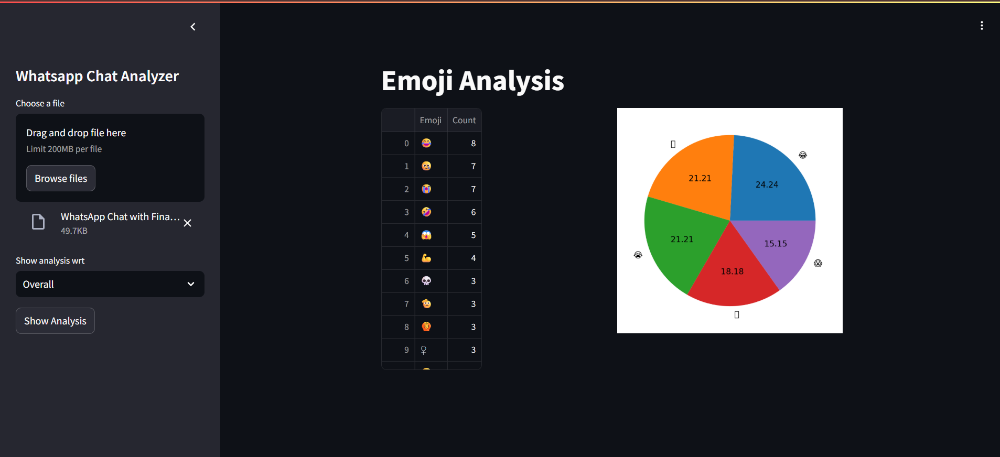

# 💬 Chatify – AI Chat Analytics Tool

Chatify is an AI-powered chat analytics application that extracts insights and visualizations from exported WhatsApp conversations.

It transforms raw chat data into meaningful statistics and visual patterns that help users understand communication behavior and conversation trends.

🔗 Live App: https://whatsapp-chat-analyzer-x50o.onrender.com/

---

# 📌 Overview

Messaging platforms generate large volumes of unstructured conversational data. Extracting meaningful insights from these conversations manually can be difficult and time-consuming.

Chatify solves this problem by converting WhatsApp chat exports into structured datasets and generating visual analytics that reveal patterns in communication behavior.

The application provides an interactive dashboard where users can upload chat files and instantly explore insights.

---

# ✨ Features

• Upload exported WhatsApp `.txt` chat files  
• Message, word, link, and media statistics  
• Most active users analysis  
• Daily and monthly activity timelines  
• Word cloud visualization for frequent words  
• Emoji usage frequency analysis  
• Interactive dashboard built with Streamlit  

---

# 🧠 How It Works

1. Raw WhatsApp chat text files are parsed using regular expressions.
2. Messages are structured into a Pandas DataFrame.
3. Aggregations and statistical metrics are computed.
4. Visualizations are generated using Matplotlib and WordCloud.
5. Streamlit renders results in an interactive dashboard.

---

# 🛠 Tech Stack

Python  
Streamlit  
Pandas  
Matplotlib  
Seaborn  
WordCloud  
Regex for text preprocessing  

---

# 🚀 Potential Improvements

Future enhancements could include:

• sentiment analysis of conversations  
• support for additional messaging platforms  

---

# 🖼 Screenshots

(Add screenshots here)

---

# 🎯 Learning Outcome

This project explores how **natural language processing and data analytics can transform conversational data into meaningful insights**, demonstrating how AI tools can help analyze communication patterns at scale.

## 🖼 Screenshots

### Homescreen

### Dashboard Statistics & Timeline

### Word Cloud Analysis

### Emoji Analysis

